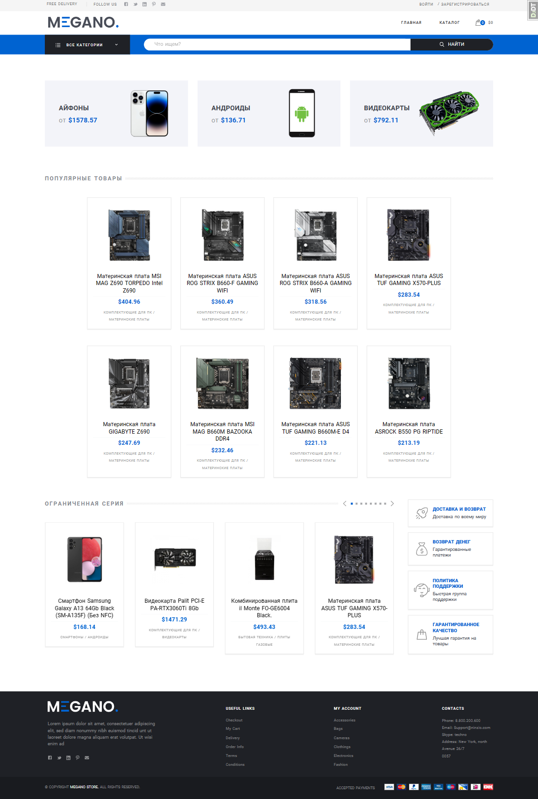

# Интернет-магазин MEGANO

<div align="center">
    
</div>

## Общая информация
Данный проект был написан командой разработки, по уже готовому шаблону фронта, в основном занимались backend-составляющей, при необходимости корректируя и дополняя html-,js-,css-код.
Состав команды:
 - Team-Lead: Максим Семенюк
 - Александр Афанасьев
 - Алёна Андриевская
 - Багаудин Абдулмеджидов
 - Эльдар Кодзаев
 - Куратор: Кристина Кукарская


## Структура проекта
### Проект состит из следующих частей
1. Приложения:
 - `app_cart` - приложения корзины для храния товаров перед оформлением заказа;
 - `app_goods` - приложение товаров магазина;
 - `app_order` - приложение заказа для оформления и храния данных о заказе
 - `app_payment` - приложение платежа для оплаты заказа;
 - `app_settings` - приложение настроек для хранения, изменения и получение данных для сервисов магазина;
 - `app_users` - приложение пользователи для храния данных акаунта пользователей;
2. Директории шаблонов:
 - `templates`;
3. Документация:
 - `README.md` - файл документации;
 - `requirements.txt` - файл зависимостей;
4. Служебные директории:
 - `fixtures` - фикстуры с тестовыми данными для заполнения сайта контентом;
 - `static` - статичные файлы сайта;
 - `media` - директория для хранеия медиа-контента моделей;
5. Системные и служебные файлы:
 - `config` - директория настроек django-проекта;
 - прочие файлы и настройки проекта;

Документация по каждому из приложений расположена в директории `Readme`.

## Установка проекта
Для установки исходника интернет магазина необходимо ввести следующую команду:
```
git clone https://gitlab.skillbox.ru/kurator_skillbox/python_django_team19.git
```
Чтобы проект работал корректно, необходимо установить зависимости командой:
```
git install -r requirements/requirements.txt
```
В случае если нужно установить зависимости для доработки, правки, или последующей разработки, следует использовать команду:
```
git install -r requirements/dev_requirements.txt
```
После Того, как все зависимости будут установлены, необходимо создать и заполнить файл виртуального окружения `.env` по образцу `env.template`.

Следующим шагом будет создание суперпользователя для управления и доступа в админ-панель. Сделать это можно командой:
```
python manage.py createsuperuser
```
Также предусмотрена возможность заполнения проекта тестовыми данными с использованием скрипта `loadscript`:
```
python manage.py loadscript no_clear
```
Более подробно узнать о функциях скрипта можно в файле loadscript.md 

## Особенности
В проекте используется шаблонизатор jinja2 (https://jinja.palletsprojects.com)

